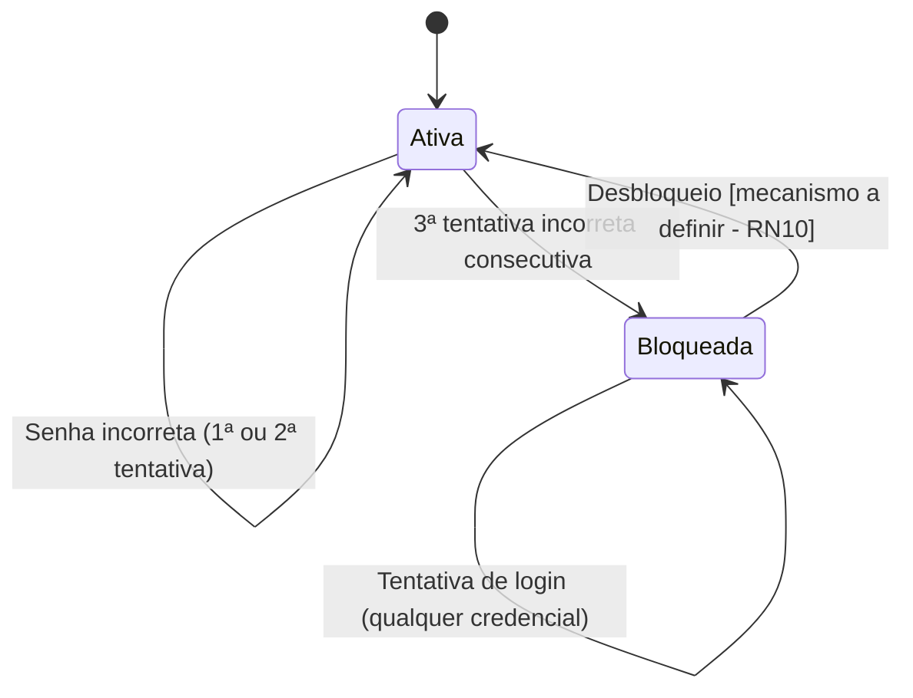
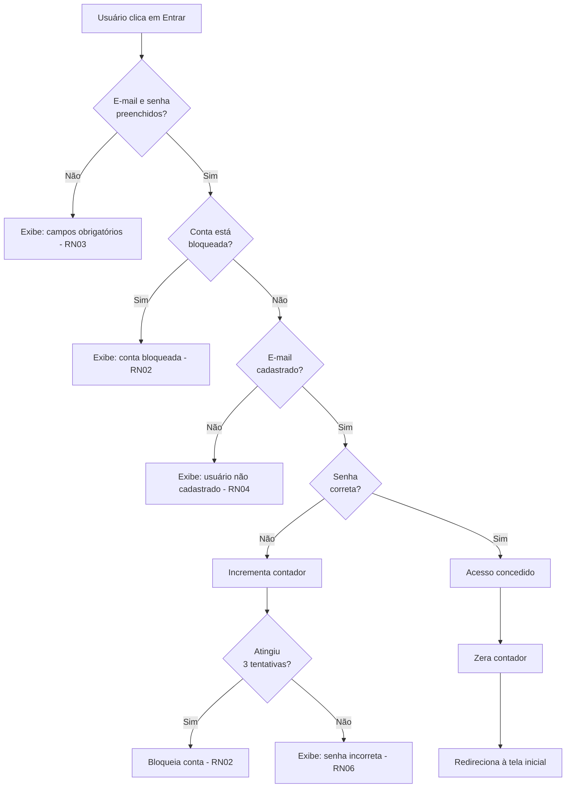

# Documentação de Requisitos — Funcionalidade de Login
**Sistema:** TerraLink | **Aplicativo (front-end):** BioVigia
**Analista responsável:** Análise de Negócios Sênior
**Origem:** Tela de login (mockup) + Regras de Negócio fornecidas pelo PO

---

## 1. Contexto e Referência Visual

A tela analisada apresenta o aplicativo **BioVigia**, com identidade visual voltada a monitoramento ambiental/conservação (cenário de savana, ícone de mapa/vida selvagem). A tela de login contém:

| Elemento de UI | Tipo | Função |
|---|---|---|
| Campo "E-mail" | Input de texto | Identificação do usuário (login) |
| Campo "Senha" | Input mascarado | Autenticação |
| Botão "Entrar" | Ação primária | Submeter credenciais |
| Link "Esqueci minha senha?" | Navegação | Aciona fluxo de recuperação de senha (fora do escopo deste documento) |
| Link "Criar conta" | Navegação | Aciona fluxo de cadastro (fora do escopo deste documento) |
| 3 ícones sociais (rodapé) | Navegação externa | Aparentam ser Instagram, um ícone não identificável com clareza (possível WhatsApp/contato institucional) e um terceiro ícone — **recomenda-se confirmar com o time de UX/UI o destino exato de cada ícone antes da especificação técnica**, pois podem representar login social, o que impactaria diretamente o desenho desta funcionalidade. |

> ⚠️ **Premissa assumida (validar com o PO):** o nome do app na interface ("BioVigia") é a marca voltada ao usuário final, enquanto "TerraLink" (citado nas regras de negócio) é o sistema/plataforma de back-end. Caso essa suposição esteja incorreta, os textos de mensagem de erro neste documento devem ser ajustados.

---

## 2. Atores

| Ator | Descrição |
|---|---|
| **Usuário** | Pessoa cadastrada no sistema TerraLink (ex.: agente de campo, monitor ambiental, gestor) que deseja acessar o aplicativo BioVigia. |
| **Sistema TerraLink** | Sistema responsável por autenticar credenciais, controlar tentativas de acesso e liberar/bloquear sessão. |

---

## 3. Regras de Negócio

### 3.1 Regras fornecidas pelo PO

| ID | Descrição |
|---|---|
| RN01 | É necessário login e senha para acessar o sistema TerraLink. |
| RN02 | Se o usuário errar a senha 3 vezes, o sistema TerraLink bloqueia o acesso. |
| RN03 | Se faltar login ou senha, o sistema deve informar que ambos os parâmetros são necessários. |
| RN04 | Se o usuário não estiver cadastrado, o sistema deve informar que é necessário criar uma conta. |
| RN05 | Se o usuário (login) estiver incorreto, o sistema deve informar ao usuário. |
| RN06 | Se a senha estiver incorreta, o sistema deve informar ao usuário. |

### 3.2 Gaps identificados e regras complementares sugeridas

As regras acima não cobrem alguns cenários que **precisam de definição do PO antes da construção técnica**. Como analista, sinalizo cada gap com uma proposta de regra, mas todas exigem validação formal:

| ID | Gap identificado | Proposta (a validar) |
|---|---|---|
| RN07 | RN04 e RN05 parecem redundantes/conflitantes — RN04 fala em "usuário não cadastrado" e RN05 fala em "usuário incorreto". | Interpretação adotada: RN05 trata de erro genérico de formato/campo; RN04 trata especificamente do caso em que o e-mail informado **não existe na base**. Ambas mensagens devem ser tratadas como sinônimas na prática (ver RN08 abaixo, motivo de segurança). |
| RN08 | Não há definição sobre **enumeração de usuários** (risco de segurança: informar se o e-mail existe ou não permite a um atacante mapear contas válidas). | Recomenda-se mensagem única e genérica ("E-mail ou senha inválidos") tanto para e-mail inexistente quanto para senha incorreta, **exceto** se o PO aceitar o risco em nome da usabilidade (conforme RN04/RN05 pedem explicitamente mensagens diferentes). **Necessário alinhamento com o PO/segurança.** |
| RN09 | Não há validação de **formato** de e-mail (ex.: "abc" sem "@"). | Sugerido: validação de formato client-side antes de qualquer chamada ao servidor, com mensagem "Informe um e-mail válido". |
| RN10 | Não há definição de **duração do bloqueio** (RN02) nem de como desbloquear (tempo, e-mail de desbloqueio, ação de admin). | **Ponto crítico em aberto** — ver Seção 5. |
| RN11 | Não há definição se o contador de tentativas erradas **zera** após login bem-sucedido ou após um período de tempo. | Sugerido: contador zera imediatamente após login bem-sucedido. |
| RN12 | Não há requisito de mascaramento/segurança da senha em trânsito e em repouso. | Ver Seção 8 (Requisitos Não Funcionais). |

---

## 4. Premissas e Pontos em Aberto (para validação com o PO)

1. **Duração/mecanismo de desbloqueio (RN02):** o bloqueio é permanente até ação de um administrador, ou temporário (ex.: 15 minutos)? Existe fluxo de desbloqueio via e-mail?
2. **Contagem de tentativas:** o contador é por conta (e-mail) ou por dispositivo/IP? Reinicia quando?
3. **Mensagens de erro (RN04/RN05):** confirmar se o time de segurança aceita diferenciar "usuário não cadastrado" de "senha incorreta" (risco de enumeração de contas) ou se deve ser mensagem genérica.
4. **Ícones sociais no rodapé:** são apenas links externos (redes sociais institucionais) ou opções de login social (Google/Facebook)? Isso afeta diretamente esta funcionalidade.
5. **"Login"** é sempre e-mail, ou o sistema também aceitará nome de usuário/CPF no futuro? A tela atual só mostra campo "E-mail".

---

## 5. Histórias de Usuário

### US01 — Login com sucesso
**Como** usuário cadastrado no sistema TerraLink,
**quero** informar meu e-mail e senha corretos,
**para que** eu possa acessar o aplicativo BioVigia.

**Critérios de aceite (resumo):**
- Dado que o e-mail e a senha estão corretos, o sistema concede acesso e direciona à tela inicial.
- O contador de tentativas incorretas é zerado após login bem-sucedido.

---

### US02 — Validação de campos obrigatórios
**Como** usuário do sistema TerraLink,
**quero** ser avisado quando esquecer de preencher e-mail e/ou senha,
**para que** eu entenda o que falta para acessar o sistema.

**Critérios de aceite (resumo):**
- Se e-mail estiver vazio, senha estiver vazia, ou ambos, o sistema exibe mensagem informando que ambos os campos são obrigatórios (RN03).
- O botão "Entrar" não deve submeter a requisição ao back-end quando há campo vazio (validação client-side).

---

### US03 — Tratamento de usuário não cadastrado
**Como** usuário que ainda não possui conta,
**quero** ser informado de que preciso me cadastrar,
**para que** eu saiba como prosseguir.

**Critérios de aceite (resumo):**
- Se o e-mail informado não existir na base do TerraLink, o sistema informa que é necessário criar uma conta (RN04) e sugere o link "Criar conta".

---

### US04 — Tratamento de senha incorreta
**Como** usuário cadastrado que errou a senha,
**quero** ser avisado do erro,
**para que** eu possa tentar novamente com a senha correta.

**Critérios de aceite (resumo):**
- Se o e-mail existir mas a senha não corresponder, o sistema informa que a senha está incorreta (RN06) e incrementa o contador de tentativas da conta.

---

### US05 — Bloqueio por tentativas excedidas
**Como** sistema TerraLink,
**quero** bloquear o acesso após 3 tentativas de senha incorreta,
**para que** contas sejam protegidas contra tentativas indevidas de acesso (ataque de força bruta).

**Critérios de aceite (resumo):**
- Ao atingir a 3ª tentativa incorreta consecutiva, a conta é bloqueada (RN02).
- Novas tentativas de login nessa conta — mesmo com senha correta — devem ser recusadas enquanto o bloqueio estiver ativo, com mensagem informando o bloqueio.
- *(Depende de definição do RN10 — duração/desbloqueio)*.

---

### Histórias relacionadas fora do escopo deste documento
- **US-REC** — Recuperação de senha (acionada por "Esqueci minha senha?").
- **US-CAD** — Criação de conta (acionada por "Criar conta").
- **US-SOCIAL** — Login via redes sociais (a confirmar se aplicável, ver Seção 4, item 4).

---

## 6. Especificação BDD (Gherkin)

```gherkin
# language: pt
Funcionalidade: Login no sistema TerraLink
  Como usuário do aplicativo BioVigia
  Eu quero acessar o sistema TerraLink com minhas credenciais
  Para utilizar as funcionalidades do sistema

  Contexto:
    Dado que o usuário "welington@example.com" está cadastrado no sistema TerraLink
    E a senha cadastrada para esse usuário é "SenhaCorreta123"
    E o contador de tentativas incorretas do usuário está zerado
    E o usuário não está bloqueado

  @sucesso
  Cenário: Login realizado com sucesso
    Dado que o usuário está na tela de login do BioVigia
    Quando ele preenche o campo "E-mail" com "welington@example.com"
    E preenche o campo "Senha" com "SenhaCorreta123"
    E clica no botão "Entrar"
    Então o sistema TerraLink concede acesso ao usuário
    E o usuário é redirecionado para a tela inicial do aplicativo
    E o contador de tentativas incorretas é zerado

  @validacao-campo
  Esquema do Cenário: Campos obrigatórios não preenchidos
    Dado que o usuário está na tela de login do BioVigia
    Quando ele preenche o campo "E-mail" com "<email>"
    E preenche o campo "Senha" com "<senha>"
    E clica no botão "Entrar"
    Então o sistema TerraLink exibe a mensagem "E-mail e senha são obrigatórios para acessar o sistema TerraLink"
    E o acesso não é concedido

    Exemplos:
      | email                    | senha            |
      |                          | SenhaCorreta123  |
      | welington@example.com    |                  |
      |                          |                  |

  @usuario-nao-cadastrado
  Cenário: Tentativa de login com e-mail não cadastrado
    Dado que o usuário está na tela de login do BioVigia
    Quando ele preenche o campo "E-mail" com "naoexiste@example.com"
    E preenche o campo "Senha" com "QualquerSenha123"
    E clica no botão "Entrar"
    Então o sistema TerraLink exibe a mensagem "Usuário não cadastrado. Crie uma conta para continuar."
    E o acesso não é concedido

  @senha-incorreta
  Cenário: Tentativa de login com senha incorreta
    Dado que o usuário está na tela de login do BioVigia
    Quando ele preenche o campo "E-mail" com "welington@example.com"
    E preenche o campo "Senha" com "SenhaErrada000"
    E clica no botão "Entrar"
    Então o sistema TerraLink exibe a mensagem "Senha incorreta"
    E o acesso não é concedido
    E o contador de tentativas incorretas do usuário é incrementado em 1

  @bloqueio
  Cenário: Conta bloqueada após 3 tentativas de senha incorreta
    Dado que o usuário já errou a senha 2 vezes consecutivas
    Quando ele preenche o campo "E-mail" com "welington@example.com"
    E preenche o campo "Senha" com "SenhaErrada000"
    E clica no botão "Entrar"
    Então essa é a 3ª tentativa incorreta consecutiva
    E o sistema TerraLink bloqueia o acesso da conta
    E o sistema exibe a mensagem "Sua conta foi bloqueada após 3 tentativas incorretas"

  @bloqueio-ativo
  Cenário: Tentativa de login com conta já bloqueada
    Dado que a conta do usuário "welington@example.com" está bloqueada
    Quando ele preenche o campo "E-mail" com "welington@example.com"
    E preenche o campo "Senha" com "SenhaCorreta123"
    E clica no botão "Entrar"
    Então o sistema TerraLink recusa o acesso
    E exibe a mensagem "Conta bloqueada. Entre em contato com o suporte para desbloqueio."
    # Nota: fluxo de desbloqueio depende de definição do RN10 (ver Seção 4)
```

---

## 7. Caso de Uso Detalhado

### UC01 — Efetuar Login

| Campo | Descrição |
|---|---|
| **Ator principal** | Usuário |
| **Atores secundários** | Sistema TerraLink |
| **Pré-condições** | O usuário possui o aplicativo BioVigia instalado/acessível e está na tela de login. |
| **Pós-condições (sucesso)** | Usuário autenticado e sessão iniciada; contador de tentativas zerado. |
| **Pós-condições (falha)** | Usuário permanece na tela de login com mensagem de erro correspondente; nenhuma sessão é criada. |
| **Gatilho** | Usuário clica no botão "Entrar". |

**Fluxo Principal (Basic Flow):**
1. Usuário acessa a tela de login do BioVigia.
2. Usuário informa e-mail e senha.
3. Usuário clica em "Entrar".
4. Sistema TerraLink valida se ambos os campos foram preenchidos.
5. Sistema verifica se a conta associada ao e-mail está bloqueada.
6. Sistema verifica se o e-mail está cadastrado.
7. Sistema verifica se a senha corresponde ao e-mail informado.
8. Sistema autentica o usuário, zera o contador de tentativas e inicia a sessão.
9. Sistema redireciona o usuário para a tela inicial do aplicativo.

**Fluxos Alternativos:**
- **FA01 — Campo(s) obrigatório(s) vazio(s)** (ocorre no passo 4): sistema exibe mensagem RN03 e interrompe o fluxo, retornando ao passo 2.
- **FA02 — E-mail não cadastrado** (ocorre no passo 6): sistema exibe mensagem RN04, sugere link "Criar conta" e retorna ao passo 2.
- **FA03 — Senha incorreta** (ocorre no passo 7): sistema exibe mensagem RN06, incrementa contador de tentativas em 1 e retorna ao passo 2, **exceto** se essa for a 3ª tentativa consecutiva, caso em que segue para o Fluxo de Exceção FE01.

**Fluxo de Exceção:**
- **FE01 — Bloqueio por excesso de tentativas** (originado em FA03 na 3ª tentativa, ou verificado no passo 5 se já bloqueado anteriormente): sistema bloqueia a conta (se ainda não estava), exibe mensagem RN02/instrução de desbloqueio e encerra o caso de uso sem conceder acesso.

**Requisitos Especiais:**
- O campo "Senha" deve ser mascarado (exibição tipo `•••••`) — já refletido no mockup.
- Mensagens de erro devem ser exibidas próximas ao campo relevante ou em destaque visível, conforme padrão do BioVigia.

**Regras de Negócio Relacionadas:** RN01 a RN12 (Seção 3).

---

## 8. Requisitos Não Funcionais

| Categoria | Requisito |
|---|---|
| **Segurança** | Senha deve trafegar via HTTPS/TLS e ser armazenada com hash (ex.: bcrypt/Argon2), nunca em texto puro. |
| **Segurança** | Implementar proteção contra força bruta além do bloqueio por tentativas (ex.: rate limiting por IP). |
| **Usabilidade** | Mensagens de erro devem ser claras, objetivas e em português, sem termos técnicos (ex.: evitar "erro 401"). |
| **Acessibilidade** | Campos de formulário devem ter labels associados corretamente para leitores de tela (WCAG 2.1 AA). |
| **Desempenho** | Resposta da autenticação em até 2 segundos em condições normais de rede. |
| **Auditoria** | Registrar tentativas de login (sucesso/falha) com timestamp, para fins de auditoria e detecção de anomalias. |

---

## 9. Diagrama de Estado — Bloqueio de Conta



---

## 10. Diagrama de Fluxo — Decisão de Login



---

## 11. Matriz de Rastreabilidade

| Regra de Negócio | História de Usuário | Cenário BDD | Fluxo do Caso de Uso |
|---|---|---|---|
| RN01 | US01 | Login realizado com sucesso | Fluxo Principal |
| RN02 | US05 | Conta bloqueada / Tentativa com conta bloqueada | FA03 → FE01 |
| RN03 | US02 | Campos obrigatórios não preenchidos | FA01 |
| RN04 | US03 | E-mail não cadastrado | FA02 |
| RN05 | US03/US04 | *(coberto pelos cenários de e-mail/senha incorretos)* | FA02/FA03 |
| RN06 | US04 | Senha incorreta | FA03 |

---

## 12. Próximos Passos Recomendados

1. Validar com o PO os pontos em aberto da Seção 4 (especialmente RN10 — desbloqueio de conta).
2. Confirmar com UX/UI o propósito dos 3 ícones sociais no rodapé da tela.
3. Especificar separadamente os fluxos de "Esqueci minha senha" e "Criar conta", hoje apenas referenciados.
4. Validar com o time de segurança a decisão sobre mensagens diferenciadas (RN04 vs RN06) versus mensagem genérica (RN08).
5. Revisar este documento com o time de desenvolvimento antes do refinamento técnico (Sprint Planning).
